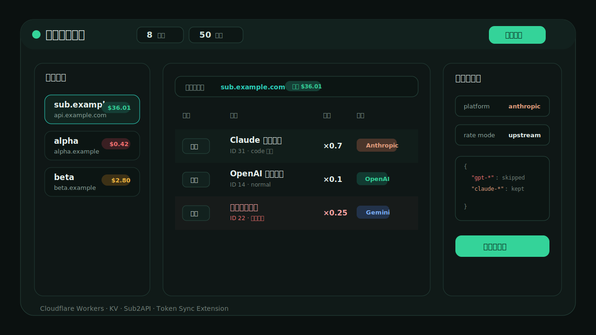

# 上游倍率监控 Upstream Monitor



一个部署在 Cloudflare Workers 上的上游分组倍率监控面板，配套 Chrome/Edge 扩展可自动同步各上游中转站的 `auth_token`。

它适合同时管理多个 New API / Sub2API 风格上游：查看分组、倍率、余额，记录倍率变化，标记/隐藏分组，并一键在上游创建 key 后导入到自己的 sub2api 本地分组。

## 功能

- 多上游管理：保存多个上游 URL 和 `auth_token`。
- 分组监控：读取上游分组 ID、名称、备注、倍率、平台、状态、类型。
- 倍率变化记录：刷新后自动对比变化，历史面板可查看和清空。
- 余额看板：读取每个上游余额，余额低/失败会高亮。
- 分组操作：选择、隐藏/恢复、标记已用/取消已用、给上游添加标记、重命名上游。
- 平台配色：OpenAI、Anthropic、Gemini、Antigravity 等平台不同颜色。
- 创建并导入：在上游创建 key，并批量导入到 sub2api 管理后台指定本地分组。
- 平台保护：导入时校验上游分组、本地分组、账号平台一致；`model_mapping` 会按平台过滤，避免 Claude 分组混入 GPT 映射。
- 登录保护：Worker 使用管理员账号密码登录，session cookie 有效期 7 天。
- 密钥加密：上游 token 和 sub2api 管理员 API Key 使用 Worker secret `ENCRYPTION_SECRET` 做 AES-GCM 加密后存 KV。
- 浏览器扩展：静默读取已打开上游页的 `localStorage.auth_token`，手动同步时可临时后台打开 `/dashboard` 读取后自动关闭。
- 移动端适配：窄屏会变成单列布局，方便手机查看。

## 目录

```text
.
├─ worker/
│  ├─ src/worker.js              # Cloudflare Worker + 内嵌前端页面
│  ├─ wrangler.example.jsonc     # Wrangler 配置模板
│  └─ .dev.vars.example          # 本地开发环境变量模板
├─ extension/
│  ├─ manifest.json              # Chrome/Edge MV3 扩展清单，需要替换域名
│  ├─ background.js              # 后台读取上游 token
│  └─ monitor-content.js         # 在监控页插入“同步 Token”按钮
├─ scripts/
│  └─ deploy-worker.ps1          # 一键创建 KV、写 secrets、部署 Worker
├─ docs/
│  ├─ deployment.md
│  ├─ extension.md
│  ├─ configuration.md
│  ├─ api.md
│  └─ development.md
└─ package.json
```

## 前置条件

- 一个 Cloudflare 账号，域名已托管到 Cloudflare。
- Node.js 18+。
- sub2api 管理后台，并准备一个管理员 API Key。
- 上游中转站登录后的 `auth_token`，通常可在上游后台控制台执行：

```js
console.log(localStorage.getItem("auth_token"))
```

## 快速部署

1. 安装依赖：

```powershell
npm install
```

2. 准备 Cloudflare API Token。Token 至少需要这些权限：

- Account Workers Scripts: Edit
- Account Workers KV Storage: Edit
- Zone Workers Routes: Edit
- Zone DNS: Edit
- Zone Zone: Read

3. 一键部署 Worker。把域名换成你自己的：

```powershell
$env:CLOUDFLARE_API_TOKEN="你的 Cloudflare API Token"
.\scripts\deploy-worker.ps1 `
  -ZoneName "example.com" `
  -RoutePattern "monitor.example.com/*" `
  -WorkerName "upstream-monitor" `
  -AdminUser "admin"
```

脚本会：

- 创建或复用 KV namespace。
- 生成 `worker/wrangler.jsonc`。
- 写入 Worker secrets：`ADMIN_USER`、`ADMIN_PASSWORD`、`ENCRYPTION_SECRET`。
- 创建 Worker route。
- 创建/更新 `monitor.example.com` 的 proxied CNAME。
- 部署 Worker。

4. 打开监控页，登录后先配置 sub2api：

- `base_url`：你的 sub2api 地址，例如 `https://sub2api.example.com`
- 管理员 API Key：sub2api 后台使用的 admin key

5. 添加上游：

- 名称可留空。
- URL 填上游中转站地址。
- `auth_token` 填该上游登录后的 token。

6. 点击“刷新全部”，读取上游分组、倍率和余额。

## 本地预览

```powershell
Copy-Item worker\.dev.vars.example worker\.dev.vars
Copy-Item worker\wrangler.example.jsonc worker\wrangler.jsonc
npm install
npm run dev
```

打开 `http://localhost:8788`。本地 KV 由 Wrangler 模拟，不会写入线上数据。

## 浏览器扩展

发布前先把 `extension/manifest.json` 里的 `YOUR_MONITOR_DOMAIN` 替换成你的监控域名，例如：

```json
"https://monitor.example.com/*"
```

然后在 Chrome/Edge：

1. 打开 `chrome://extensions` 或 `edge://extensions`。
2. 开启“开发者模式”。
3. 选择“加载已解压的扩展”。
4. 选择本项目的 `extension/` 目录。

扩展会在监控页面顶部添加“同步 Token”按钮。自动检查只复用已打开的上游页面；手动点击会临时在后台打开上游 `/dashboard`，读取 `localStorage.auth_token` 后关闭。

## 重要安全说明

- 不要把 `worker/wrangler.jsonc`、`.dev.vars`、Cloudflare token、sub2api admin key、上游 `auth_token` 提交到 GitHub。
- `ENCRYPTION_SECRET` 部署后请长期保留。如果更换它，KV 里已保存的 token/API key 将无法解密，需要重新填写。
- 本项目会保存高权限 token，建议只部署在你自己的 Cloudflare 账号和域名下。
- 扩展默认 host 权限较宽，因为需要读取不同上游域名的 `localStorage`。如果你只管理固定域名，可以在 `manifest.json` 中收窄 `host_permissions`。

## 和原部署保持一致

如果你想复刻现有线上形态：

- Worker 用 Cloudflare Workers。
- KV binding 名称保持 `MONITOR_DATA`。
- 域名使用 `monitor.your-domain.com/*`。
- Worker secrets 设置：
  - `ADMIN_USER`
  - `ADMIN_PASSWORD`
  - `ENCRYPTION_SECRET`
- 打开网页后，在“sub2api 服务器”里保存你的 sub2api `base_url` 和管理员 API Key。
- 安装扩展，并把 manifest 域名改成同一个监控域名。

## 文档

- [部署文档](docs/deployment.md)
- [扩展文档](docs/extension.md)
- [配置说明](docs/configuration.md)
- [接口说明](docs/api.md)
- [二开说明](docs/development.md)
